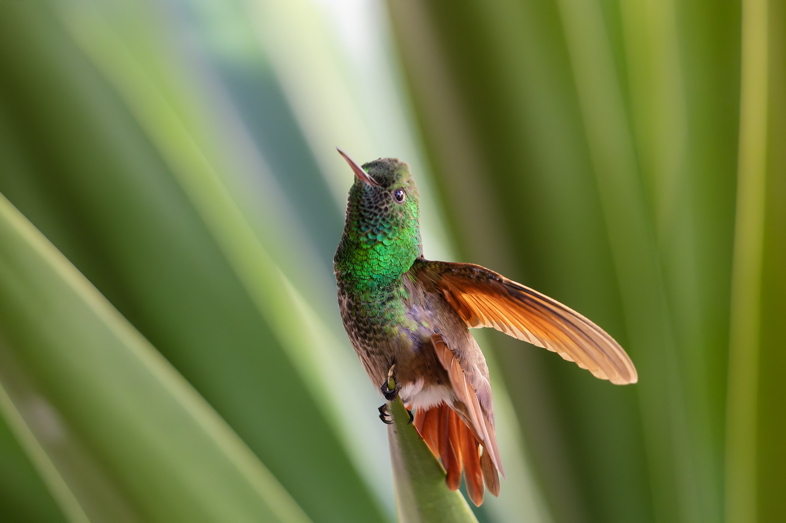
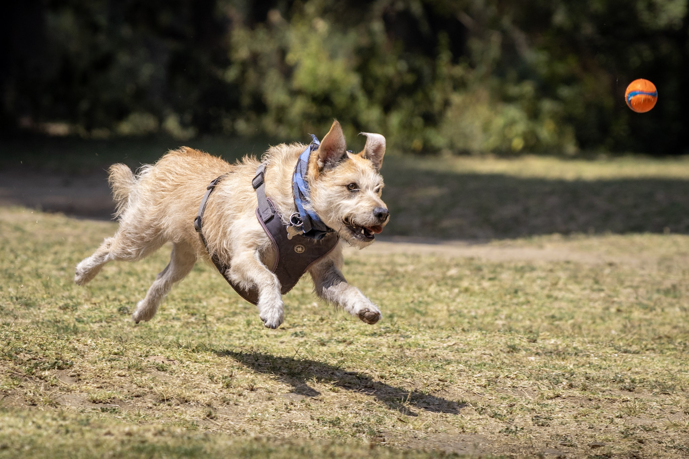
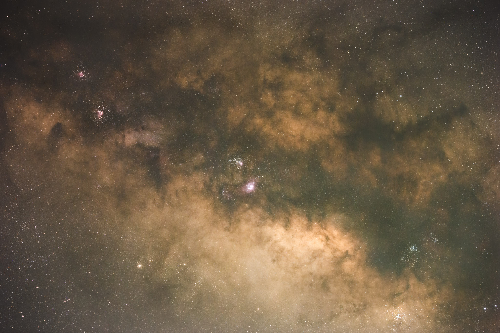
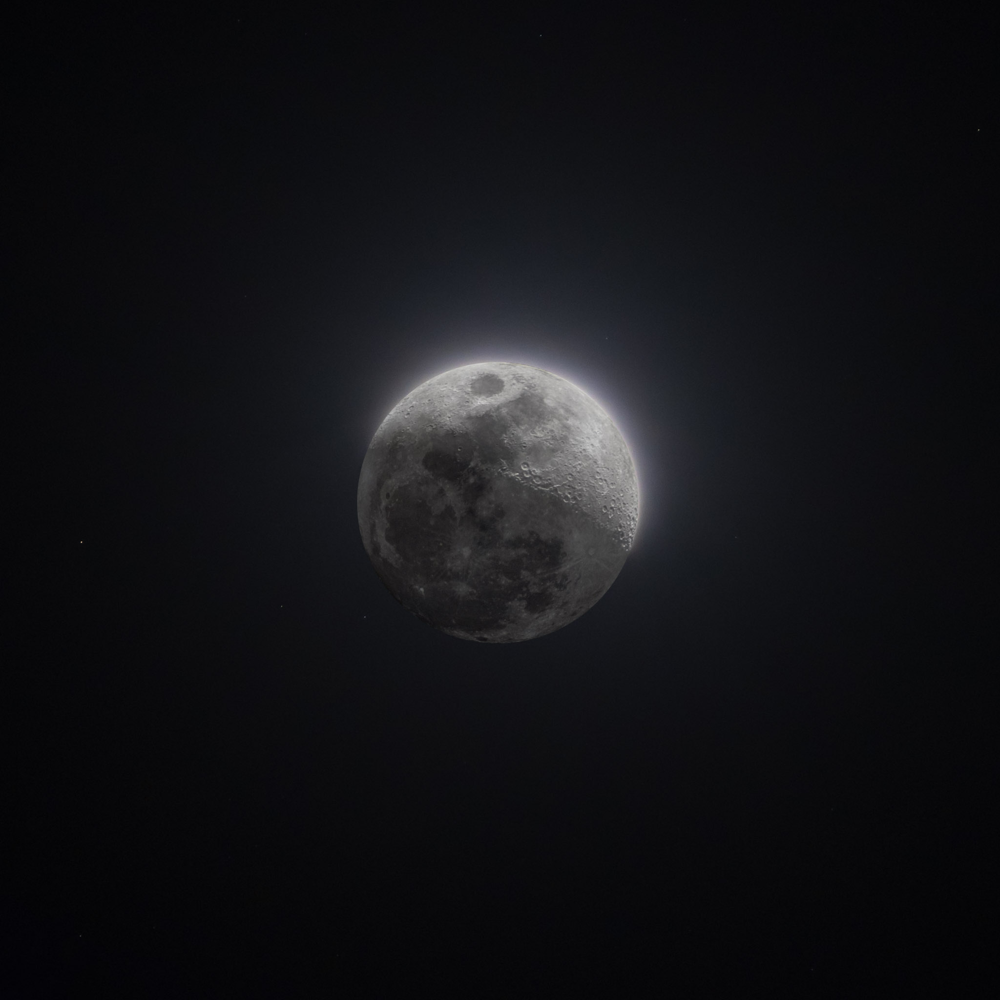

0. this unordered seed list will be replaced by toc as unordered list
{:toc}

When I am not working or doing research, I really like taking photos, especially landscapes and astrophotography. Here are a few photos that I like.

  
  
  
  
  
  

<!-- Lightbox container -->

  

