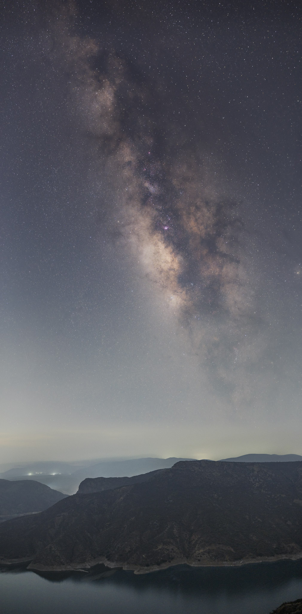
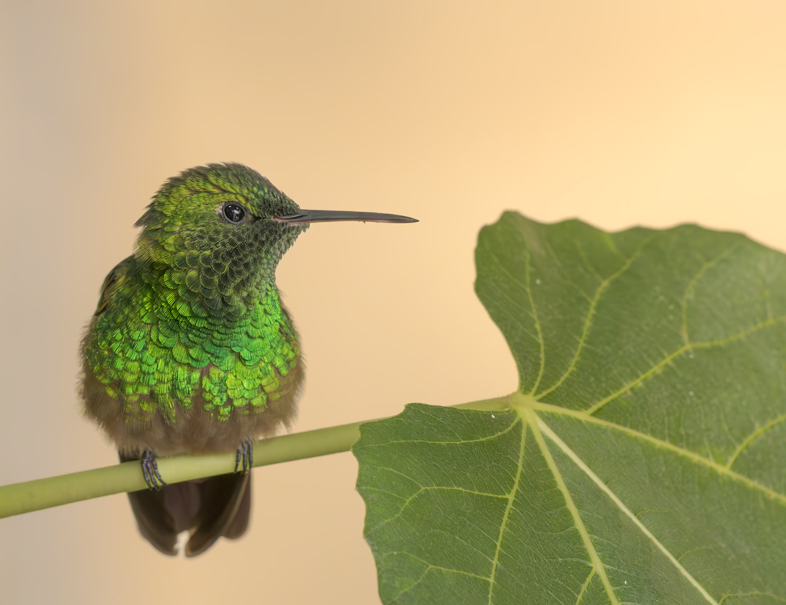
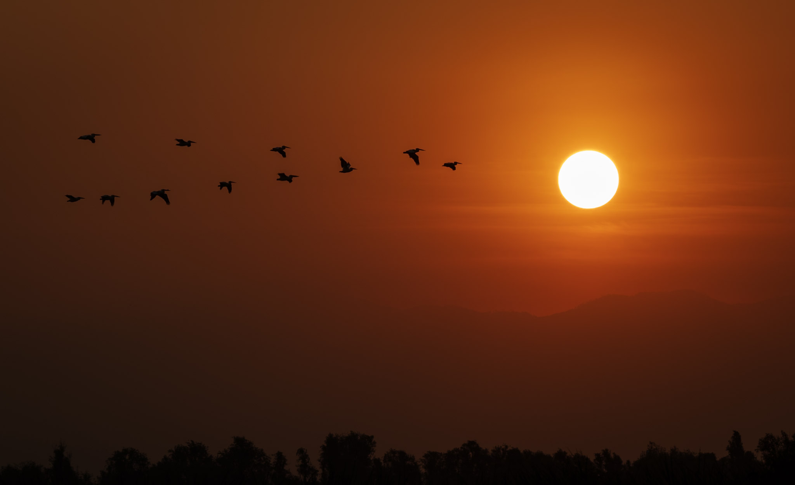

<!--
  Always reload once on entering /photography/ by using a URL parameter.
  If “reload=1” is not present, append it and reload.
-->

0. this unordered seed list will be replaced by toc as unordered list
  {:toc}

When I am not working or doing research, I really like taking photos, especially **landscapes**, **astrophotography** and **moon/sun alignments**. Here are a few photos that I like.

<!-- ======= PHOTO GRID SECTION ======= -->

  

    
  

  

    
  

  

    
  

  

    
  

  

    
  

  

    
  

  

    
  

  

    
  

  

    
  

  

    
  

  

    
  

  

    
  

  

    
  

  

    
  

  

    
  

<!-- Lightbox container -->

  

<!-- Include imagesLoaded + Masonry.js from CDN -->

